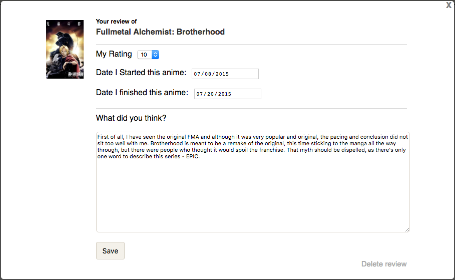
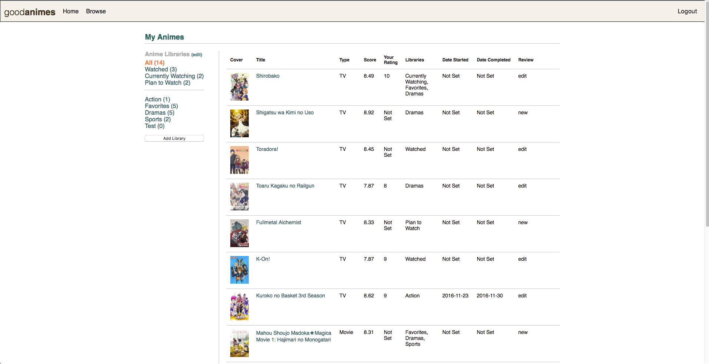
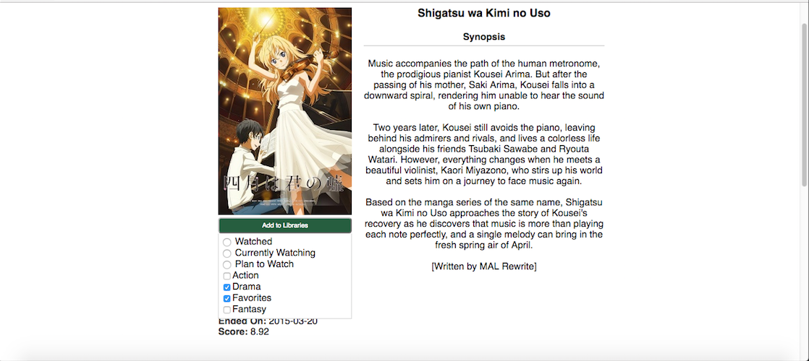

# Good Animes
[Heroku link][heroku]
[heroku]: https://goodanimes.herokuapp.com/

GoodAnimes is a content discovery platform for all types of anime watchers. It allows fans to keep track of any animes they have or are interested in watching and discover new animes to watch. Goodanimes is built with a React/Redux frontend and a Rails/PostGreSQL backend.

## Seed Data
Goodanimes gets its anime seed data via myanimelist's API, it makes several search queries to the api and parses the XML response to create anime entries for the database. This allows each anime entry to have the most accurate and detailed information from episode count to a concise summary.

## Features and Implementation

Goodanimes uses the React Router to keep all of its content on a single root page. While navigating the site, user data, anime, and reviews are all managed in a local store. It gets this information from the backend rails API, which serves data in JSON format using jbuilder. To further condense the number of routes in the react router, the site uses modals for several of its features. These include the login form and the create/edit  review form.



###View all your libraries
The home page after login is the libraries index page. Here a user is displayed an index of all their libraries and as well as every anime entry in each library. This is achieved using Active Record relations with JBuilder to create an API response with all the necessary information. The backend is structured as such that animes, users, and anime_libraries are all connected by a join table known as user_anime. This allows me to pull up the relevant information about which animes a library contains as well as the user review info for that anime if it exists. In addition, an "All" library is dynamically generated from this API response to replicate the "All" bookshelf a user has when they use Goodreads. I decided to dynamically generate this because the
"All" bookshelf on Goodreads does not exist as an actual shelf. I cannot add books to my "All" bookshelf so it didn't make sense to me create an "All" bookshelf object for every user. Instead I used the same tools as above, ActiveRecord and JBuilder to generate this library for me and for the library to always be the first element of the API response.



### Add Animes to libraries
Users can add animes to any or all of their libraries from a menu on the details page of an Anime. The dropdown menu shows all the libraries of an Anime already belongs to. This menu features both checkboxes and radio buttons to distinguish functionality. A user starts with three libraries that cannot be deleted, Watched, Plan to Watch and Currently Watching. These denote statuses for an anime much like how Goodreads handles statuses by placing them into bookshelves titled Reading, Finished Reading, etc. These three libraries in the menu are denoted by a radio button since you can only select one radio button at a time, it makes no sense for someone to "Plan to Watch" an Anime they are "currently watching" so I eliminate that option for the user. The checkboxes are user created custom libraries. These can be any libraries you want to further categorize your anime whether its by genre or "Friends Recommendations", etc. All adding and deleting from libraries are done dynamically so if you uncheck a box and check it, it will delete the anime and then read it again. This is designed to give the user the best possible experience so that there is one less clicked needed to be made to save changes. 




### Add reviews to animes
Reviews can be added to animes by two different places, the anime show page and the library index. These are accomplished via modals. Reviews are retrieved by both the anime and the library using the relationship that an anime has many reviews. Then custom actions in redux are created to either update the library's state or the anime page's state based on the location prop that is passed to the container. Like the library all the data is called from just the anime show controller.
```ruby
{
"id": 138,
"title": "Fullmetal Alchemist: Brotherhood",
"synopsis": "&quot;In order for something to be obtained, something of equal value must be lost.&quot;<br />\n<br />\nAlchemy is bound by this Law of Equivalent Exchange&mdash;something the young brothers Edward and Alphonse Elric only realize after attempting human transmutation: the one forbidden act of alchemy. They pay a terrible price for their transgression&mdash;Edward loses his left leg, Alphonse his physical body. It is only by the desperate sacrifice of Edward&#039;s right arm that he is able to affix Alphonse&#039;s soul to a suit of armor. Devastated and alone, it is the hope that they would both eventually return to their original bodies that gives Edward the inspiration to obtain metal limbs called &quot;automail&quot; and become a state alchemist, the Fullmetal Alchemist.<br />\n<br />\nThree years of searching later, the brothers seek the Philosopher&#039;s Stone, a mythical relic that allows an alchemist to overcome the Law of Equivalent Exchange. Even with military allies Colonel Roy Mustang, Lieutenant Riza Hawkeye, and Lieutenant Colonel Maes Hughes on their side, the brothers find themselves caught up in a nationwide conspiracy that leads them not only to the true nature of the elusive Philosopher&#039;s Stone, but their country&#039;s murky history as well. In between finding a serial killer and racing against time, Edward and Alphonse must ask themselves if what they are doing will make them human again... or take away their humanity.<br />\n<br />\n[Written by MAL Rewrite]",
"start_date": "2009-04-05",
"end_date": "2010-07-04",
"image": "https://myanimelist.cdn-dena.com/images/anime/5/47421.jpg",
"score": 9.26,
"episodes": 64,
"media_type": "TV",
"status": "Finished Airing",
"libraries": [
"Action"
],
"reviews": [
{
"id": 1,
"user_id": 1,
"anime_id": 138,
"user_rating": 10,
"user_start_date": "2015-07-08",
"user_end_date": "2015-07-20",
"body": "First of all, I have seen the original FMA and although it was very popular and original, the pacing and conclusion did not sit too well with me. Brotherhood is meant to be a remake of the original, this time sticking to the manga all the way through, but there were people who thought it would spoil the franchise. That myth should be dispelled, as there's only one word to describe this series - EPIC.",
"updated_at": "2016-11-11T23:06:43.899Z",
"user": {
"id": 1,
"username": "Guest",
"password_digest": "$2a$10$xMBpDjs3llCxu2wnYt8Qheh7yQhuX/Z4A1jZLT4oRMjzHOsVYpi1S",
"session_token": "hSACMLU4Xm3Cc-pnyd8hTQ",
"created_at": "2016-11-11T23:06:42.904Z",
"updated_at": "2016-11-11T23:07:39.029Z"
},
"created_at": "2016-11-11"
},
```


## Future Features
There are still features goodanimes is missing, the ones that are the most crucial are:

### Search
Browsing an anime index is nice but a user wants to be able to search for a title by name to access it quicker.

### Infinite pagination
On the other hand, a user might want to browse the anime index page for a while, and right now the anime database is limited because I do not want to show too many animes on one page. Infinite pagination would fix this issue.

### Genres/Search by genre
While users can browse animes, they can't filter by a specific genre they might already like. Adding a tag like feature to each anime to give them a genre tag would improve user experience by telling the user what type of show the anime is as well as allowing the user to filter for their favorite genres.
